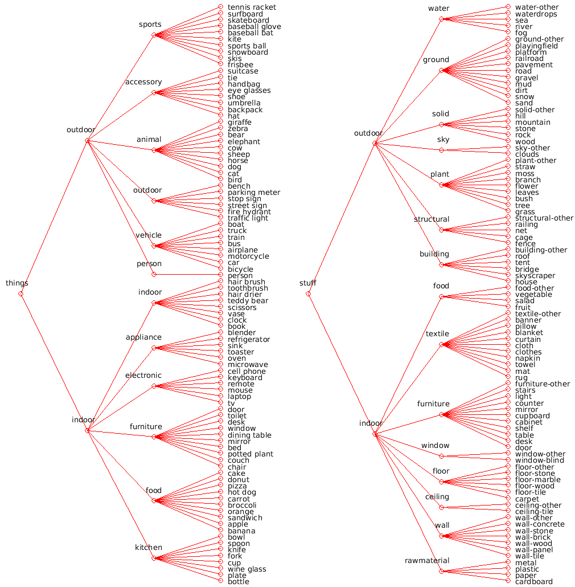
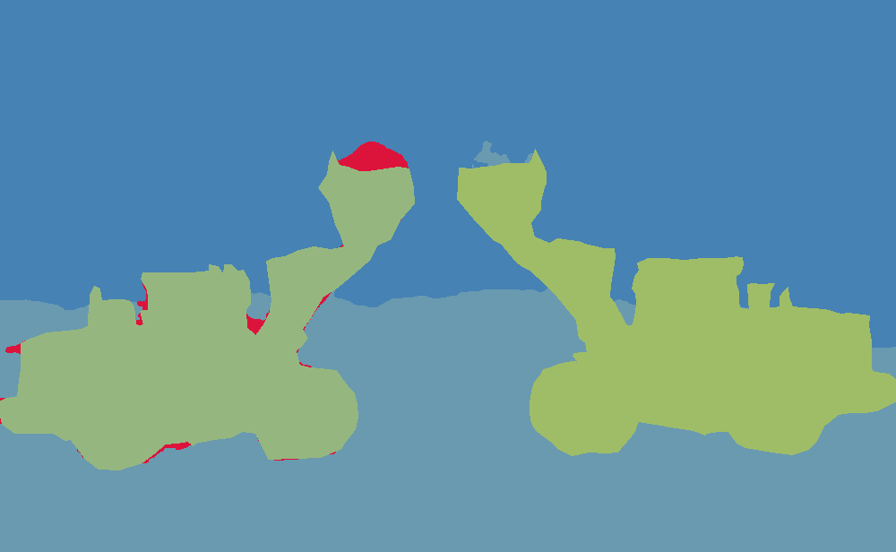

# Dataset Preparation


## About

> To download the dataset [click here](https://drive.google.com/file/d/1IsK268zLnXB2Qq0X2LgNDwBZRuVwvjRx/view?usp=sharing)

The construction dataset was created and annotated by students of TSAI. We wanted to use this dataset to train DETR Panoptic segmentation model. For this purpose, we have only annotated the things category here as annotating the stuff category would take lot of time and effort. The annotation for things was done using [CVAT](https://github.com/openvinotoolkit/cvat) tool and was stored in **COCO 1.0** format. We then decided to use Pre-trained DETR Panoptic segmentation model (trained on the COCO dataset) to annotate the stuff class and later merge both annotations to create the final panoptic segmentation ground truth.  

## Dataset Details

The dataset contains images for 48 different categories which are listed below: 

```python
construction_classes = [
"aac_blocks", "adhesives", "ahus", "aluminium_frames_for_false_ceiling", "chiller",
"concrete_mixer_machine", "concrete_pump", "control_panel", "cu_piping", "distribution_transformer",
"dump_truck_tipper_truck", "emulsion_paint", "enamel_paint","fine_aggregate", "fire_buckets",
"fire_extinguishers", "glass_wool","grader", "hoist","hollow_concrete_blocks",
"hot_mix_plant", "hydra_crane","interlocked_switched_socket","junction_box","lime",
"marble", "metal_primer", "pipe_fittings", "rcc_hume_pipes", "refrigerant_gas",
"river_sand", "rmc_batching_plant", "rmu_units", "sanitary_fixtures",
"skid_steer_loader", "smoke_detectors", "split_units", "structural_steel_channel",
"switch_boards_and_switches",  "texture_paint", "threaded_rod", "transit_mixer", "vcb_panel",
"vitrified_tiles", "vrf_units", "water_tank", "wheel_loader", "wood_primer"
]  
```

In total the dataset has around **10k Images** for all the classes  combined, with very high imbalance, like 15 images for one class and 500+ images for other. The details for each class is presented in a text file for each of the folders that is created for each class. The class details contains the class name, label used to define the class, total number of images and total number of annotations available for the class. 

## Structure of the dataset

```
├── class_name_1
│   ├── class_details.txt
│   ├── coco.json
│   └── images
│       ├── img_000.png
│       ├── img_001.png
├── class_name_2
│   ├── class_details.txt
│   ├── coco.json
│   └── images
│       ├── img_000.png
│       ├── img_001.png
```


## What is COCO?

COCO ([official website](https://cocodataset.org/#home)) dataset, meaning “Common Objects In Context”, is a set of challenging,  high quality datasets for computer vision, mostly state-of-the-art  neural networks. This name is also used to name a format used by those datasets. Quoting COCO creators:

> COCO is a large-scale object detection, segmentation, and captioning dataset. COCO has several features:
>
> - Object segmentation
> - Recognition in context
> - Superpixel stuff segmentation
> - 330K images (>200K labeled)
> - 1.5 million object instances
> - 80 object categories
> - 91 stuff categories
> - 5 captions per image
> - 250,000 people with keypoints

There are even tools built specifically to work with datasets in COCO format, e. g. [COCO-annotator](https://github.com/jsbroks/coco-annotator) and [COCOapi](https://github.com/cocodataset/cocoapi). Understanding how this dataset is represented will help with using and  modifying the existing datasets and also with creating the custom ones. 

## COCO dataset format

### Basic structure and common elements

File format used by COCO annotations is JSON, which has dictionary (key-value pairs inside braces) as a top value. It can also have lists (ordered collections of items inside brackets) or dictionaries nested inside. Basic structure is as follows:

```json
{
  "info": {…},
  "licenses": […],
  "images": […],
  "categories": […],
  "annotations": […]
}
```

The format of the JSON can be vary as per the task like object-detection, segmentation, keypoint-detection or image-captioning. In all these formats, the `images`, `info` and `licenses` remains same, where as the `annotations` and `categories` format will differ.

### Info section

This dictionary contains metadata about the dataset. For the official COCO datasets, it is as follows:

```json
{
  "description": "COCO 2017 Dataset",
  "url": "http://cocodataset.org",
  "version": "1.0",
  "year": 2017,
  "contributor": "COCO Consortium",
  "date_created": "2017/09/01"
}
```

### Licenses section

Here are links to licenses for images in the dataset, e. g. Creative Commons licenses, with the following structure:

```json
[
  {
    "url": "http://creativecommons.org/licenses/by-nc-sa/2.0/", 
    "id": 1, 
    "name": "Attribution-NonCommercial-ShareAlike License"
  },
  …
]
```

### Images section

This dictionary contains metadata about the images:

```json
{
  "license": 3,
  "file_name": "000000391895.jpg",
  "coco_url": "http://images.cocodataset.org/train2017/000000391895.jpg",
  "height": 360,
  "width": 640,
  "date_captured": "2013–11–14 11:18:45",
  "flickr_url": "http://farm9.staticflickr.com/8186/8119368305_4e622c8349_z.jpg",
  "id": 391895
}
```

- `license`: the ID of the image license from the `licenses`section
- `file_name`: the the name of the file in the images directory
- `coco_url`, `lickr_url`: URLs to the online hosted image copy
- `height`, `width`: size of image, very handy in low-level languages like C where getting size of matrix is impossible or hard
- `date_captured`: when the photo was taken
- `id`: This is the most important field.  This is the number that is used in `annotations` to identify the image

### Categories section

This section a bit different for object detection and segmentation task.

**Object detection:**

```json
[
  {"supercategory": "person", "id": 1, "name": "person"},
  {"supercategory": "vehicle", "id": 2, "name": "bicycle"},
  {"supercategory": "vehicle", "id": 3, "name": "car"},
  …
  {"supercategory": "indoor", "id": 90, "name": "toothbrush"}
]
```

These are classes of objects that may be detected on images. Each category has a unique `id` and they should be in range [1, number of categories]. Categories are  also grouped in “supercategories”, which you may use in your programs e. g. to detect vehicles in general, when you don’t care whether it’s a  bicycle, car or truck.

**Panoptic segmentation:**

```json
[
  {"color": [220, 20, 60], "supercategory": "person", "isthing": 1, "id": 1, "name": "person"},  
  … 
  {"color": [255, 255, 128], "supercategory": "textile", "isthing": 0, "id": 92, "name": "banner"},
  …
]
```

Each category struct has two additional fields: isthing that distinguishes stuff and thing categories and color that is useful for consistent visualization.

### Annotations section

This is the most important section of the dataset, which contains information vital for each task for specific COCO dataset.

**Object detection:** 

```json
{
  "segmentation":
  [[
    239.97,
    260.24,
    222.04,
    …
  ]],
  "area": 2765.1486500000005,
  "iscrowd": 0,
  "image_id": 558840,
  "bbox":
  [
    199.84,
    200.46,
    77.71,
    70.88
  ],
  "category_id": 58,
  "id": 156
}
```

- `segmentation`: a list of segmentation mask pixels. This is a flattened list of pairs, so you should take the first and the second value (x and y at the  picture), then the third and the fourth etc. to get coordinates. Note that these are not image indices, since they are floating numbers — they are created and compressed by tools like COCO-annotator from raw pixel coordinates
- `area`: number of pixels inside segmentation mask
- `iscrowd`: whether the annotation is for a single object (value 0), or for multiple objects close to each other (value 1). For stuff segmentation this field is always 0 and is ignored
- `image_id`: the ‘id’ field from the ‘images’ dictionary. This value should be used to cross-reference the image with other dictionaries, not the `id` field of annotation dictionary!
- `bbox`: bounding box coordinates (top left x, top left y, width,  height) of the rectangle around the object.
- `category_id`: class of the object, corresponding to the `id` field in `categories`
- `id`: unique identifier for annotation. This is only annotation ID, this does not point to the particular image in other dictionaries!

While working with crowd images (`iscrowd`: 1), the `segmentation` part may be a little different:

```json
"segmentation":
{
  "counts": [179,27,392,41,…,55,20],
  "size": [426,640]
}
```

This is because for a lot of pixels explicitly listing all pixels creating  segmentation mask would take a lot of space. Instead, COCO uses custom  Run-Length Encoding (RLE) compression, which is very efficient, since  segmentation masks are binary and RLE for only 0s and 1s may decrease size many times.

**Panoptic segmentation**

For the panoptic task, each annotation struct is a *per-image annotation* rather than a per-object annotation. Each per-image annotation has two parts: (1) a PNG that stores the *class-agnostic image segmentation* and (2) a JSON struct that stores the *semantic information* for each image segment. In more detail:

1. To match an annotation with an image, use the image_id field (that is annotation.image_id==image.id).
2. For each annotation, per-pixel segment ids are stored as a single PNG at annotation.file_name. Each segment (whether it's a stuff or thing segment) is assigned a  unique id. Unlabeled pixels (void) are assigned a value of 0. Note that  when you load the PNG as an RGB image, you will need to compute the ids via ids=R+G*256+B*256^2.
3. For each annotation, per-segment info is stored in annotation.segments_info. segment_info.id stores the unique id of the segment and is used to retrieve the corresponding mask from the PNG (ids==segment_info.id). category_id gives the semantic category and iscrowd indicates the segment encompasses a group of objects (relevant for thing categories only). The bbox and area fields provide additional info about the segment.

```json
annotation
{
    "segments_info": [segment_info], 
    "file_name": "000000000285.png", 
    "image_id": 285
}

segment_info = 
{
    "id": 5931152, 
    "category_id": 23, 
    "iscrowd": 0, 
    "bbox": [1, 69, 585, 564], 
    "area": 275827
} 
```


## Creating the final dataset

The COCO things and stuff category is shown below



The construction dataset contains only things category. For the panoptic segmentation task, we also require stuff category. For this purpose, all the COCO low level stuff category (as shown in the above figure) was taken and collapsed into high level categories as shown below. Also all the COCO things category was put into category called **Miscellaneous**. So the final dataset would consist of 16 stuff categories and 48 construction things categories. 

```python
CUSTOM_CATEGORIES = [
	{"color": [220, 20, 60], "isthing": 0, "id": 1, "name": "misc"},
	{"color": [58, 41, 149], "isthing": 0, "id": 2, "name": "water"},
	{"color": [106, 154, 176], "isthing": 0, "id": 3, "name": "ground"},
	{"color": [64, 170, 64], "isthing": 0, "id": 4, "name": "solid"},
	{"color": [70, 130, 180], "isthing": 0, "id": 5, "name": "sky"},
	{"color": [241, 129, 0], "isthing": 0, "id": 6, "name": "plant"},
	{"color": [193, 0, 92], "isthing": 0, "id": 7, "name": "structural"},
	{"color": [150, 100, 100], "isthing": 0, "id": 8, "name": "building"},
	{"color": [217, 17, 255], "isthing": 0, "id": 9, "name": "food"},
	{"color": [255, 255, 128], "isthing": 0, "id": 10, "name": "textile"},
	{"color": [146, 112, 198], "isthing": 0, "id": 11, "name": "furniture"},
	{"color": [183, 121, 142], "isthing": 0, "id": 12, "name": "window"},
	{"color": [218, 88, 184], "isthing": 0, "id": 13, "name": "floor"},
	{"color": [146, 139, 141], "isthing": 0, "id": 14, "name": "ceiling"},
	{"color": [137, 54, 74], "isthing": 0, "id": 15, "name": "wall"},
	{"color": [168, 171, 172], "isthing": 0, "id": 16, "name": "rawmaterial"},
]
```

### Adding masks for stuff category

As we already know DETR is trained to predict both stuffs and things categories. We will use pretrained DETR model (`detr_resnet101_panoptic`) to predict these low level stuff category and map them to high level stuff category. Note that some of images may not be present RGB format (gray format and others might  be in RGBN format). So while loading the image we convert them to RGB format with 3 channels.

```python
# Read the image and get the shape
image_org = Image.open(processing_file).convert('RGB')

try:
    h, w, c = np.array(image_org).shape
except:
    h, w = np.array(image_org).shape
    c = 1

# if no of channels != 3, open the image and convert it to 3 channel - RGB
if c == 4 or c == 1:
    image_org = image_org.convert('RGB')
    h, w, c = np.array(image_org).shape

# Create a copy of image this will be used for further processing
im = image_org.copy()

# Apply transform and convert image to batch
# mean-std normalize the input image (batch-size: 1) size: [h, w, c] -> [1, c, ht, wt]
img = transform(im).unsqueeze(0).to(device)  

```

Once we get the predicted mask from the DETR model (refer the [notebook](https://colab.research.google.com/github/facebookresearch/detr/blob/colab/notebooks/DETR_panoptic.ipynb#scrollTo=LAjJjP9kAHhA) to see how to predict mask), we merge the predicted mask with original annotation from dataset to create a new mask. We also map the corresponding high level category ID to the new mask.

```python
#Code to paste original annotation on top of the predicted mask custom_panoptic_seg_id
def get_original_mask(image_size, annotations):
  height, width = image_size

  # create a single channel height, width pixel black image
  blank_image = np.zeros((height, width))

  # Create list of polygons to be drawn
  polygons_list = []

  # Add the polygon segmentation
  for segmentation_points in annotations["segmentation"]:
      segmentation_points = np.array(segmentation_points).reshape((int(len(segmentation_points)/2), 2))
      polygons_list.append(Polygon(segmentation_points))

  for poly in polygons_list:
      contours = poly.get_xy().astype(np.int32)
      cv2.fillPoly(blank_image, pts=[contours], color=(1, 1, 1))
      
  return blank_image

# annotations of our construction things
mask_original = processing_data['annotations']

# Overlay things mask one at a time
for annotation in mask_original:
    # overlay mask of construction things on top of detr output
    mask_original_image_id = get_original_mask((h, w), annotation)
    custom_panoptic_seg_id[mask_original_image_id.astype(np.bool_)] = custom_panoptic_seg_id.max() + 1
    custom_panoptic_segments_info.append({
        'segment_id': custom_panoptic_seg_id.max(), 
        'category_id': cat2id[category_name], 
        'bbox': annotation['bbox'],
        'area': annotation['area'],
        'iscrowd': 0,
        'isthing': 1
    })

```

 After creating new mask, we calculate the area and the bounding box coordinates for the stuff segments by using the [pycococreator](https://github.com/waspinator/pycococreator) tool. The `id` for the annotation is generated using the **IdGenerator** from [panopticapi](https://github.com/cocodataset/panopticapi.git). The [pycococreator](https://github.com/waspinator/pycococreator) tool also helps to convert the COCO panoptic data format to COCO detection format. As we have all the required fields in the right format, we finally dump everything into the json file.

Check out the [Notebook](./construction_dataset_creation_v5.ipynb) for more details. Here are the

- [Processed images](https://drive.google.com/file/d/1glNu-wyvRpUVHsPY8PA1Q2G_qUIZbC-o/view?usp=sharing)
- [Mask images](https://drive.google.com/file/d/1g-UzrPitq6siqSFkRGqazVMjN0vEXOyQ/view?usp=sharing)
- [Annotations](./annotations)

### Example mask image




### Train-Test split

Once the annotation files are ready, 80-20 split is done to create separate the data for training and testing. Checkout the [notebook](./construction_train_test_split.ipynb) for more info.


## References

- [https://patrickwasp.com/create-your-own-coco-style-dataset/](https://patrickwasp.com/create-your-own-coco-style-dataset/)
- [https://cocodataset.org/#format-data](https://cocodataset.org/#format-data)
- [https://towardsdatascience.com/getting-started-with-coco-dataset-82def99fa0b8](https://towardsdatascience.com/getting-started-with-coco-dataset-82def99fa0b8)


