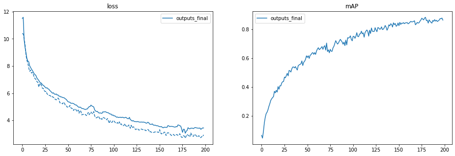
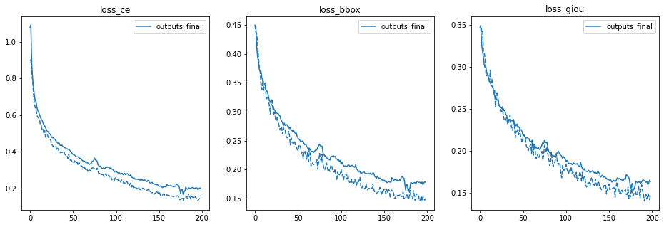
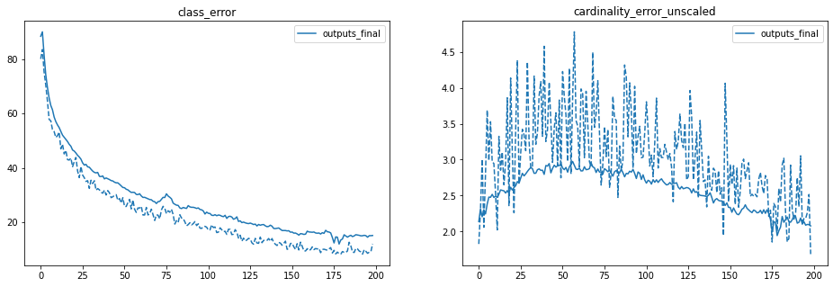

# Fine Tuning of DETR

Here we are going to fine-tune Facebook's DETR (DEtection TRansformer) on the construction dataset (custom dataset) to predict the bounding box around both things and stuff category. We will be using [detr-r50](https://dl.fbaipublicfiles.com/detr/detr-r50-e632da11.pth) to train model. Most of the steps done here are referred from [this](https://www.youtube.com/watch?v=RkhXoj_Vvr4) beautiful youtube video.

**Note**: Fine-tuning is recommended if your dataset has [less than 10k images](https://github.com/facebookresearch/detr/issues/9#issuecomment-635357693). Otherwise, training from scratch would be an option.

## Code Preparation

**Step 1:** Clone the DETR repo from github. Download pre-trained model and delete the class embedding and the bias weight. We will be using this to start our training from. 

```python
# Get pretrained weights
checkpoint = torch.hub.load_state_dict_from_url(
         url='https://dl.fbaipublicfiles.com/detr/detr-r50-e632da11.pth',
         map_location='cpu',
         check_hash=True)

# Remove class weights
del checkpoint["model"]["class_embed.weight"]
del checkpoint["model"]["class_embed.bias"]

# Save
torch.save(checkpoint,
        'detr-r50_no_class_head.pth')
```

**Step 2:** The next step is to create a custom data loader for the construction dataset. The data loader can be referred from file [detr/datasets/coco.py](https://github.com/facebookresearch/detr/blob/main/datasets/coco.py)

**Step 3:** Update the dataset builder to use our custom_construction dataset file. Go to [detr/datasets/**__init__**.py](https://github.com/facebookresearch/detr/blob/main/datasets/__init__.py) and update build_dataset function as below

```python
if args.dataset_file == 'custom_construction':
  from .custom_construction import build as build_custom_construction
  return build_custom_construction(image_set, args)
if args.dataset_file == 'custom_construction_panoptic':
  from .custom_construction_panoptic import build as build_construction_panoptic
  return build_construction_panoptic(image_set, args)   
```

**Step 4:** Update the number of classes in build function in detr/models/detr.py. Note that we should always use `num_classes = max_id + 1` where `max_id` is the highest class ID that you have in your dataset, i.e , if class ID are 1,2 and 5 then `num_classes = 5 + 1 = 6`. We have marked classes from  17 to 64 for `things` and from 1 to 16  for `stuff`, so for us the max_id for the classes is 64, hence we can give num_classes as 65, where the extra class at end is for `no-object`

```python
if args.dataset_file == 'custom_construction':
  # "You should always use num_classes = max_id + 1 where max_id is the highest class ID that you have in your dataset."
  # Reference: https://github.com/facebookresearch/detr/issues/108#issuecomment-650269223
  num_classes = 65
if args.dataset_file == "custom_construction_panoptic":
  num_classes = 65     
```

## Model Training

We have trained the model for 200 epochs in total. The argument resume allows us to start the training from the saved checkpoints. 

```python
!python main.py \
--dataset_file "custom_construction" \
--data_path "/content/drive/MyDrive/EVA6/Capstone/dataset" \
--output_dir "/content/drive/MyDrive/EVA6/Capstone/outputs" \
--resume "resume_checkpoint.pth" \
--epochs 200
```

The notebook used for bbox detection training can be found [here](./construction_detection_train_v1.ipynb). Here are:

- the last [checkpoint](https://drive.google.com/file/d/106wZcQRNuGJ8_-uFv257J7gRhFCGoPg3/view?usp=sharing) (~ 500 MB),
- the [log file](https://drive.google.com/file/d/1x-MBcngdoNJW-d77Ewlk8_g2PU35IbZq/view?usp=sharing).


## Inference and Metrics

The metrics include:

- the Average Precision (AP), which is [the primary challenge metric](https://cocodataset.org/#detection-eval) for the COCO dataset,
- losses (total loss, classification loss, l1 bbox distance loss, GIoU loss),
- errors (cardinality error, class error).

As mentioned in [the paper](https://arxiv.org/abs/2005.12872), there are 3 components to the matching cost and to the total loss:

- classification loss

```python
def loss_labels(self, outputs, targets, indices, num_boxes, log=True):
"""Classification loss (NLL)
targets dicts must contain the key "labels" containing a tensor of dim [nb_target_boxes]
"""
[...]
loss_ce = F.cross_entropy(src_logits.transpose(1, 2), target_classes, self.empty_weight)
losses = {'loss_ce': loss_ce}
```

- L1 bounding box distance loss,

```python
def loss_boxes(self, outputs, targets, indices, num_boxes):
"""Compute the losses related to the bounding boxes, the L1 regression loss and the GIoU loss
   targets dicts must contain the key "boxes" containing a tensor of dim [nb_target_boxes, 4]
   The target boxes are expected in format (center_x, center_y, w, h),normalized by the image
   size.
"""
[...]
loss_bbox = F.l1_loss(src_boxes, target_boxes, reduction='none')
losses['loss_bbox'] = loss_bbox.sum() / num_boxes
```

- [Generalized Intersection over Union (GIoU)](https://giou.stanford.edu/) loss, which is scale-invariant

```python
loss_giou = 1 - torch.diag(box_ops.generalized_box_iou(
    box_ops.box_cxcywh_to_xyxy(src_boxes),
    box_ops.box_cxcywh_to_xyxy(target_boxes)))
losses['loss_giou'] = loss_giou.sum() / num_boxes
```

There are two errors:

- cardinality error

```python
def loss_cardinality(self, outputs, targets, indices, num_boxes):
""" Compute the cardinality error, ie the absolute error in the number of predicted non-empty
boxes. This is not really a loss, it is intended for logging purposes only. It doesn't
propagate gradients
"""
[...]
# Count the number of predictions that are NOT "no-object" (which is the last class)
card_pred = (pred_logits.argmax(-1) != pred_logits.shape[-1] - 1).sum(1)
card_err = F.l1_loss(card_pred.float(), tgt_lengths.float())
losses = {'cardinality_error': card_err}
```

- [class error](https://github.com/facebookresearch/detr/blob/5e66b4cd15b2b182da347103dd16578d28b49d69/models/detr.py#L126)

```python
# TODO this should probably be a separate loss, not hacked in this one here
losses['class_error'] = 100 - accuracy(src_logits[idx], target_classes_o)[0]
```

where [accuracy](https://github.com/facebookresearch/detr/blob/5e66b4cd15b2b182da347103dd16578d28b49d69/util/misc.py#L432) is:

```python
def accuracy(output, target, topk=(1,)):
"""Computes the precision@k for the specified values of k"""
```

### Result

After training for 200 epochs, the results are as follows

```
IoU metric: bbox
 Average Precision  (AP) @[ IoU=0.50:0.95 | area=   all | maxDets=100 ] = 0.753
 Average Precision  (AP) @[ IoU=0.50      | area=   all | maxDets=100 ] = 0.864
 Average Precision  (AP) @[ IoU=0.75      | area=   all | maxDets=100 ] = 0.801
 Average Precision  (AP) @[ IoU=0.50:0.95 | area= small | maxDets=100 ] = 0.387
 Average Precision  (AP) @[ IoU=0.50:0.95 | area=medium | maxDets=100 ] = 0.609
 Average Precision  (AP) @[ IoU=0.50:0.95 | area= large | maxDets=100 ] = 0.782
 Average Recall     (AR) @[ IoU=0.50:0.95 | area=   all | maxDets=  1 ] = 0.716
 Average Recall     (AR) @[ IoU=0.50:0.95 | area=   all | maxDets= 10 ] = 0.857
 Average Recall     (AR) @[ IoU=0.50:0.95 | area=   all | maxDets=100 ] = 0.871
 Average Recall     (AR) @[ IoU=0.50:0.95 | area= small | maxDets=100 ] = 0.505
 Average Recall     (AR) @[ IoU=0.50:0.95 | area=medium | maxDets=100 ] = 0.728
 Average Recall     (AR) @[ IoU=0.50:0.95 | area= large | maxDets=100 ] = 0.899
```








 

## Few Prediction examples

You can find more example predictions [here](../Predictions)

|                        Original Image                        |                    Predicted Bounding Box                    |
| :----------------------------------------------------------: | :----------------------------------------------------------: |
| <p align="center" style="padding: 10px"><br/><br/><br/></p> | <p align="center" style="padding: 10px"><br/><br/><br/></p> |
| <p align="center" style="padding: 10px"><br/><br/><br/></p> | <p align="center" style="padding: 10px"><br/><br/><br/></p> |
| <p align="center" style="padding: 10px"><br/><br/><br/></p> | <p align="center" style="padding: 10px"><br/><br/><br/></p> |
| <p align="center" style="padding: 10px"><br/><br/><br/></p> | <p align="center" style="padding: 10px"><br/><br/><br/></p> |
| <p align="center" style="padding: 10px"><br/><br/><br/></p> | <p align="center" style="padding: 10px"><br/><br/><br/></p> |


## Reference

- [https://ai.facebook.com/research/publications/end-to-end-object-detection-with-transformers](https://ai.facebook.com/research/publications/end-to-end-object-detection-with-transformers)
- [https://github.com/woctezuma/finetune-detr](https://github.com/woctezuma/finetune-detr)
- [https://www.youtube.com/watch?v=RkhXoj_Vvr4](https://www.youtube.com/watch?v=RkhXoj_Vvr4)
- [https://cocodataset.org/#detection-eval](https://cocodataset.org/#detection-eval)

