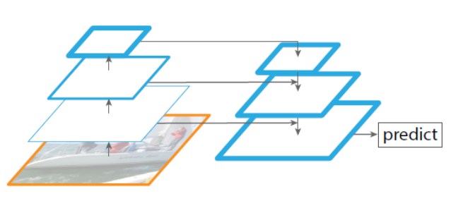

# DETR for panoptic segmentation

We train DETR to predict boxes around both stuff and things classes on construction dataset, using the object detection model. Predicting boxes is required for the training to be possible, since the Hungarian matching is computed using distances between boxes. We also add a mask head which predicts a binary mask for each of the predicted boxes, see Figure below. 

   <p align="center" style="padding: 10px">
    
    <br>
    <em style="color: grey">The figure gives an illustration of the panoptic head. A binary mask is generated in parallel for each detected object, then the masks are merged using pixel-wise argmax.</em>
  </p> 

The mask head takes as input, the output of transformer decoder for each object and computes multi-head (with M heads) attention scores of this
embedding over the output of the encoder, generating M attention heatmaps per object in a small resolution. To make the final prediction and increase the resolution, an FPN-like architecture is used. The final resolution of the masks has stride 4 and each mask is supervised independently using the DICE/F-1 loss and Focal loss. 

The mask head can be trained either jointly, or in a two steps process, where we train DETR for boxes only, then freeze all the weights and train only the mask
head for 25 epochs. To predict the final panoptic segmentation we simply use an argmax over the mask scores at each pixel, and assign the corresponding categories to the resulting masks. This procedure guarantees that the final masks have no overlaps and, therefore, DETR does not require a heuristic that is often used to align different masks.


## Panoptic Architecture


Let us now look at a few questions to consider here

- We take the encoded image (dxH/32xW/32) and send it to Multi-Head Attention. We also send dxN Box embeddings to the Multi-Head Attention (**FROM WHERE DO WE TAKE THIS ENCODED IMAGE?**) 

  The encoded image ***d x H/32 x W/32***  is the output of the **transformer encoder**. The final feature map from ResNet backbone is of size ***d x H/32 x W/32***. Let us say if the input image was of size **640x640x3** then the backbone will gives us a **20x20x2048** activation map. Then, a 1x1 convolution reduces the activation map dimension from 2048 to 256 (**20x20x2048 → 20x20x256**).  Since the encoder expects only sequential input, we collapse the spatial dimensions to 1D: (**20x20x256 → 400x256**). This embeddings after passing through the 6 layer of encoder maintains its shape and is then re-arranged to form the final transformer encoder output of size  **d x H/32 x W/32**. This encode image is then sent along the box embeddings from object detection to the Multi-Head attention layer. 

- We do something here to generate NxMxH/32xW/32 maps. (**WHAT DO WE DO HERE?**)

  We perform a **Multi Head Attention** with the Box embeddings and the encoded image from the Transformer encoder. The each box embeddings matrix is multiplied with the encoded image matrix, using *M* attention heads to get the desired *N x M x H/32 x W/32* attention heat maps, where N are the number of objects queries.

  ```python
  weights = torch.einsum("bqnc,bnchw->bqnhw", qh * self.normalize_fact, kh)
  ```

   

- Then we concatenate these maps with Res5 Block (**WHERE IS THIS COMING FROM?**)

  The attention map generated using Multi-Head attention is of small resolution. These maps needs to be up sampled to get the final segmentation mask. We use the concept of **Feature Pyramid Network** to increase the resolution. The FPN architecture used for this is shown below

  

  

  For this, while the image is send through the ResNet-50 backbone, we set aside the feature maps after every ResNet block

  - Res Block 2 -> H/4 x W/4
  - Res Block 3 -> H/8 x W/8
  - Res Block 4 -> H/16 x W/16
  - Res Block 5 -> H/32 x W/32

  The attention maps which is of size H/32 x W/32 is then concatenated with the respective size ResNet Block. 

  

- Then we perform the above steps (**EXPLAIN THESE STEPS**)

  The attention maps after Multi-Head Attention is concatenated with Res5 block feature maps and is send through a two sets of 3x3 Convolution, Group Norm and ReLU activation and then up sampled to become H/16 x W/16.  This is again repeated with corresponding feature maps from ResNet blocks. Finally we end up with final attention maps of size H/4 x W/4. Since at the beginning of ResNet, we down sample the image by 4 times, the final mask logits are 4 times smaller. 

  

  Finally these masks are passed though Pixel-wise Argmax and concatenated to get the final Panoptic Segmentation Mask.

