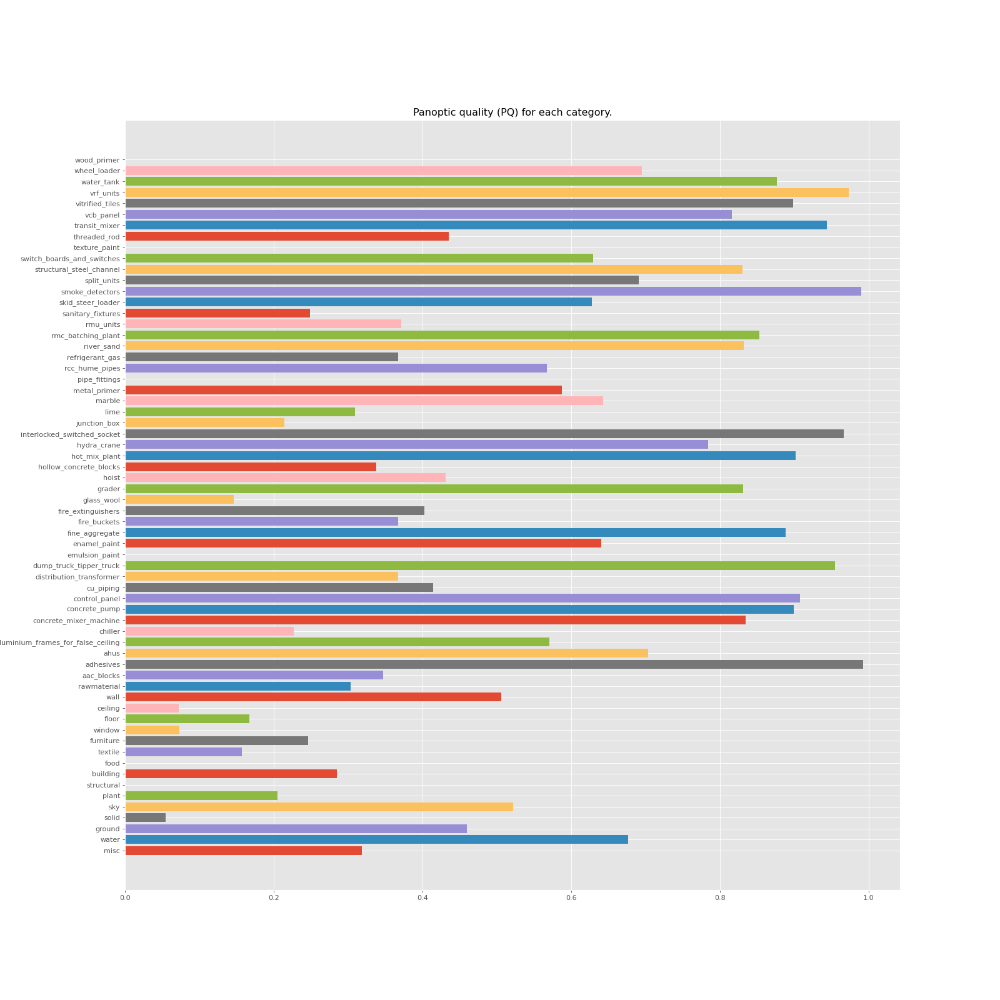
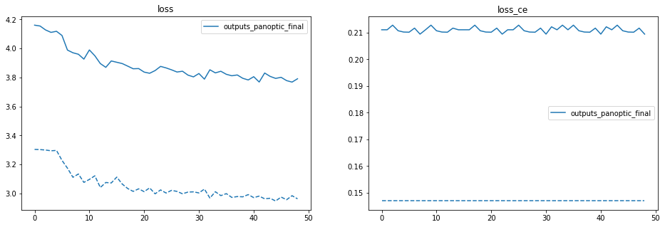
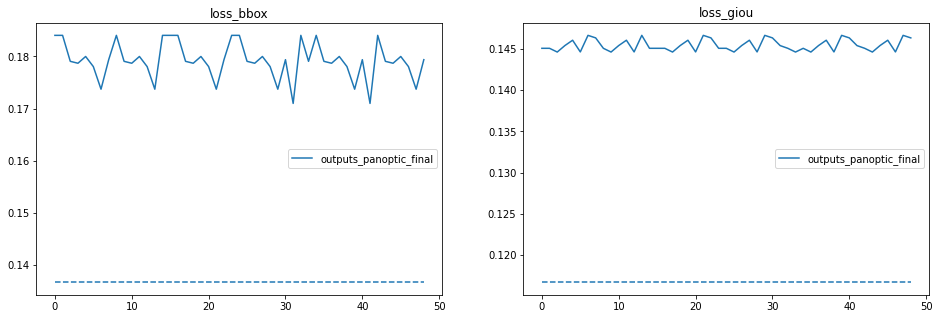
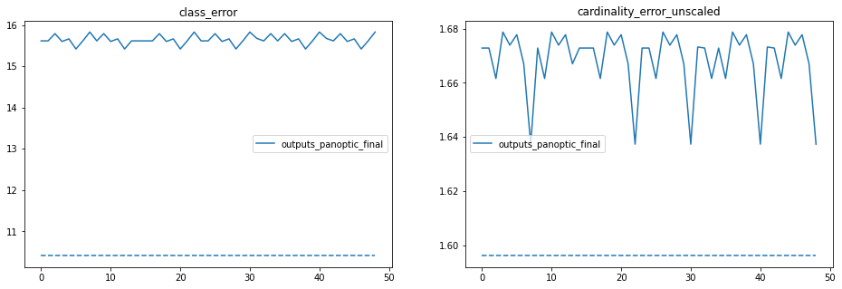

# Panoptic Segmentation

Image segmentation forms the basis of numerous Computer Vision projects. It segments the visual input to process it for tasks such as image classification and object detection. Image segmentation methods can be classified into three categories viz. semantic segmentation, instance segmentation and panoptic segmentation. 

Suppose you have an input image of a street view consisting of several people, cars, buildings etc. If you only want to group objects belonging to the same category, say distinguish all cars from all buildings, it is the task of semantic segmentation. Within each category say, people, if you want to distinguish each individual person, that will be the task of instance segmentation. Whereas if you want both category-wise as well as instance-wise division, it will be a panoptic segmentation task.

<p align="center" style="padding: 10px">
<br>
</p> 

There are two basic conventions followed in an image segmentation task which are as follows:

-   Any countable entity such as a person, bird, flower, car etc. is termed as a thing. 
-   An uncountable amorphous region of identical texture such as the sky is termed as stuff.

Study of things comes under instance segmentation since they can be assigned instance-level annotations while that of stuff comes under semantic segmentation. Panoptic segmentation handles both thing classes as well as stuff.

### **Basic difference between the three segmentation techniques**

Semantic segmentation associates every pixel of an image with a class label such as a person, flower, car and so on. It treats multiple objects of the same class as a single entity. In contrast, instance segmentation treats multiple objects of the same class as distinct individual instances. To combine the concepts of both semantic and instance segmentation, panoptic segmentation assigns two labels to each of the pixels of an image – (i)semantic label (ii) instance id. The identically labeled pixels are considered belonging to the same semantic class and instance their id’s distinguish its instances. 

Instance segmentation and panoptic segmentation both segment each object instance in an image. However, the difference lies in the handling of overlapping segments. Instance segmentation permits overlapping segments while the panoptic segmentation task allows assigning a unique semantic label and a unique instance-id each pixel of the image. Hence, for panoptic segmentation, no segment overlaps are possible.

### Confidence scores

Unlike instance segmentation, semantic segmentation and panoptic segmentation do not require confidence scores associated with each segment. This makes the study of human consistency easier for these methods.


## Panoptic Segmentation using DETR

The DETR model for the Panoptic Segmentation, remains same as the DETR  model for the Object Detection, with an addition of mask head after the  decoder part. To understand the architecture of the DETR panoptic model follow this [link](../Part1/README.md)

Training DETR is a two step process

1. First train DETR for Object Detection
2. Then add panoptic mask head and freeze base network and further train for 50 epochs

### Code preparation

**Step 1:** Create a panoptic data loader for the construction dataset by referring the [detr/datasets/coco_panoptic.py](https://github.com/facebookresearch/detr/blob/main/datasets/coco_panoptic.py)

**Step 2:** Update [detr/main.py](https://github.com/facebookresearch/detr/blob/main/main.py) as below

```python
if args.dataset_file == "custom_construction_panoptic":
    # We also evaluate AP during panoptic training, on original coco DS
    construction_detector_val = datasets.custom_construction.build("val", args)
    base_ds = get_coco_api_from_dataset(construction_detector_val)
```

**Step 3:** Go to file [detr/models/detr.py](https://github.com/facebookresearch/detr/blob/main/models/detr.py), and add following lines of code

```python
if args.dataset_file == "custom_construction_panoptic":
  num_classes = 65  
```

**Step 4:** Also update the things maps in detr.py

```python
if args.dataset_file == "custom_construction_panoptic":
    is_thing_map = {i: i >= 17 for i in range(65)}
    postprocessors["panoptic"] = PostProcessPanoptic(is_thing_map, threshold=0.85)
```

### Model Training

The panoptic head was trained for 50 epochs after freezing the object detection model. 

```python
!python main.py \
--dataset_file "custom_construction_panoptic" \
--data_path "/content/drive/MyDrive/EVA6/Capstone/dataset" \
--data_panoptic_path "/content/drive/MyDrive/EVA6/Capstone/dataset" \
--output_dir "/content/drive/MyDrive/EVA6/Capstone/outputs_panoptic" \
--masks \
--frozen_weights "resume_checkpoint_frozen.pth" \
--resume "resume_checkpoint.pth" \
--batch_size 1 \
--epochs 50
```

The notebook used for panoptic training can be found [here](./construction_panoptic_train_v1.ipynb). Here are:

- the last [checkpoint](https://drive.google.com/file/d/1awbTwO2X_cVz_l8Fzx9Zbn9COQC87tM4/view?usp=sharing) (~ 175 MB),
- the [log file](https://drive.google.com/file/d/13AeZ5hwO2cPDa4AjDKX95OWoeXKiqSj-/view?usp=sharing).

### Evaluation metrics

PQ (**Panoptic Quality**) used as a metric for panoptic segmentation equally treats all the classes – be it a thing or stuff. Computing PQ involves two steps: (1) segment matching and (2) PQ  computation given the matches. Both steps are simple and efficient.  First, for each image, the ground truth and predicted segments are  matched with an IoU threshold 0.5. Since panoptic segmentation requires  non-overlapping segments, if a threshold of 0.5 is used, *the matching is unique*. That is, there can be at most one  match per segment and so it is trivial to obtain the matches. After  matching, each segment falls into one of three sets: TP (matched pairs), FP (unmatched predicted segments), and FN (unmatched ground truth  segments). Given the TP, FP, and FN, the Panoptic Quality (PQ) metric  for each category is simply:

<p align="center" style="padding: 10px">
<br>
</p> 

PQ is computed per-category and results are averaged across categories.  Predicted segments that have significant overlaps with unlabeled or  crowd regions are filtered out from the FP set. More details of the  metric can be found in the paper. Finally, PQ can be decomposed as the  multiplication of a segmentation quality (SQ) term and a recognition  quality (RQ) term. The decomposition of PQ = SQ * RQ is useful for  providing additional insights for analysis:

<p align="center" style="padding: 10px">
<br>
</p> 

It must be noted that PQ is not a combination of semantic and instance segmentation metrics. SQ (i.e., average IoU of matched segments) and RQ (i.e., F1-Score) are computed for every class and measure segmentation and recognition quality, respectively. PQ is then calculated as (PQ = SQ * RQ). It thus unifies evaluation over all the classes.

### Losses

For segmentations (masks) DICE/F-1 loss and Focal losses are used.

#### **DICE Loss**

<p align="center" style="padding: 10px">
<br>
</p> 

Dice coefficient is a popular image segmentation algorithm, that is essentially a measure of overlap between two samples. Refer this [link](https://www.jeremyjordan.me/semantic-segmentation/) to learn more.

<p align="center" style="padding: 10px">
<br>
</p> 

#### **Focal Loss** 

Focal loss is an improved version of Cross-Entropy Loss that tries to handle  the class imbalance problem by assigning more weights to hard or easily  misclassified examples. 

<p align="center" style="padding: 10px">
<br>
</p> 

Focal loss reduces the loss contribution from easy examples and increases the importance of correcting misclassified examples. Refer this [link](https://amaarora.github.io/2020/06/29/FocalLoss.html)  to understand more.

### Result

After training for 50 epochs, the results are as follows

```
          |    PQ     SQ     RQ     N
--------------------------------------
All       |  53.1   80.0   60.7    61
Things    |  61.6   82.9   69.6    46
Stuff     |  27.0   71.2   33.5    15
```

Below image gives the reported per class PQ.  Blank space in the bar plot indiacte that the class is not present in validation annotations.











## Few Prediction examples

You can find more example predictions [here](../Predictions)

|                        Original Image                        |                    Predicted Bounding Box                    |
| :----------------------------------------------------------: | :----------------------------------------------------------: |
| <p align="center" style="padding: 10px"><br/><br/><br/></p> | <p align="center" style="padding: 10px"><br/><br/><br/></p> |
| <p align="center" style="padding: 10px"><br/><br/><br/></p> | <p align="center" style="padding: 10px"><br/><br/><br/></p> |
| <p align="center" style="padding: 10px"><br/><br/><br/></p> | <p align="center" style="padding: 10px"><br/><br/><br/></p> |
| <p align="center" style="padding: 10px"><br/><br/><br/></p> | <p align="center" style="padding: 10px"><br/><br/><br/></p> |
| <p align="center" style="padding: 10px"><br/><br/><br/></p> | <p align="center" style="padding: 10px"><br/><br/><br/></p> |


## References

- [https://analyticsindiamag.com/semantic-vs-instance-vs-panoptic-which-image-segmentation-technique-to-choose/](https://analyticsindiamag.com/semantic-vs-instance-vs-panoptic-which-image-segmentation-technique-to-choose/)

- [https://cocodataset.org/#panoptic-eval](https://cocodataset.org/#panoptic-eval)

- [https://ai.facebook.com/blog/end-to-end-object-detection-with-transformers](https://ai.facebook.com/blog/end-to-end-object-detection-with-transformers)

  


